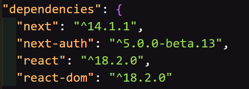
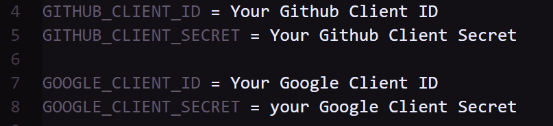

# <center> NextJs-14 Project Authentication Using Auth-Js Version 5 </center>

---

In our Next.js project, we are implementing authentication using <a href="https://authjs.dev/reference/nextjs" target="_blank">Auth-Js version 5</a>. This powerful library allows us to easily handle user authentication and authorization. By integrating Auth-Js with Next.js, we can securely manage user sessions, handle user registration and login, and enforce access control to protect sensitive routes and resources.</br>
With Auth-Js, we can provide a seamless and secure authentication experience for our users, ensuring the privacy and integrity of their data.

- # For setup in an existing project.

1. ## Packages

In this project, we are utilizing the following dependencies:👇👇



To install these packages, you can use either yarn or npm

- ### Install Packages

```
npm i next-auth@5.0.0-beta.13 next@14.1.1 react@18.2.0 react-dom@18.2.0
```

2. ## File Setup

   Move authentication folder and .env file to your current project

3. ## Variables to change



1. Navigate to .env file in root directory.
2. Put your Client ID and Secret ID in front of there respective variable (<b><u>without any comma or double-quote</u></b>).
3. Don't forget to save the file.

You'r good to go...

---

- # For starting a New Project

1. ## Setting up new project
1. If you are starting a new project just create new directory with small letters like - 'my-project'.

1. Open this folder in VS Code.
1. Open vs code terminal and run this code👇

```
git clone https://github.com/AtulVermaGithub/NextJS-14-Authentication.git
```

4. Again run this code👇

```
npm i
```

2. ## Variables to change


1. Navigate to .env file in root directory.
2. Put your Client ID and Secret ID in front of there respective variable (<b><u>without any comma or double-quote</u></b>).
3. Don't forget to save the file.

You'r good to go...